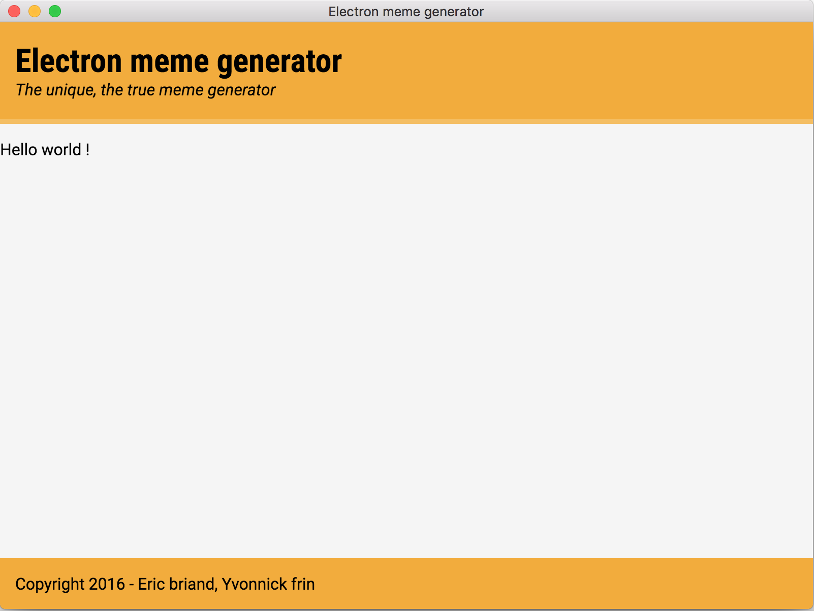
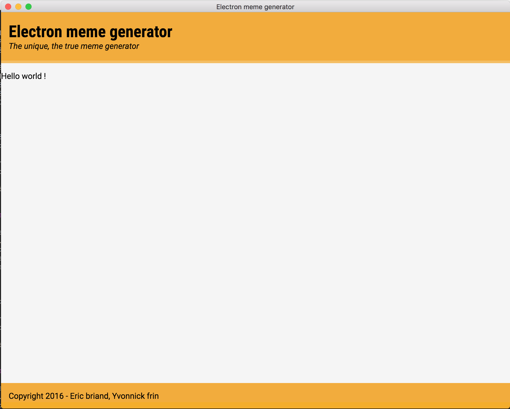
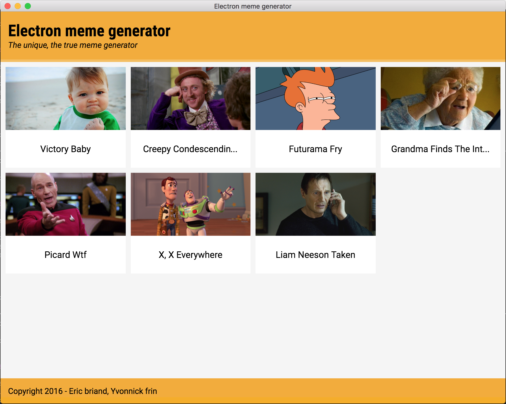
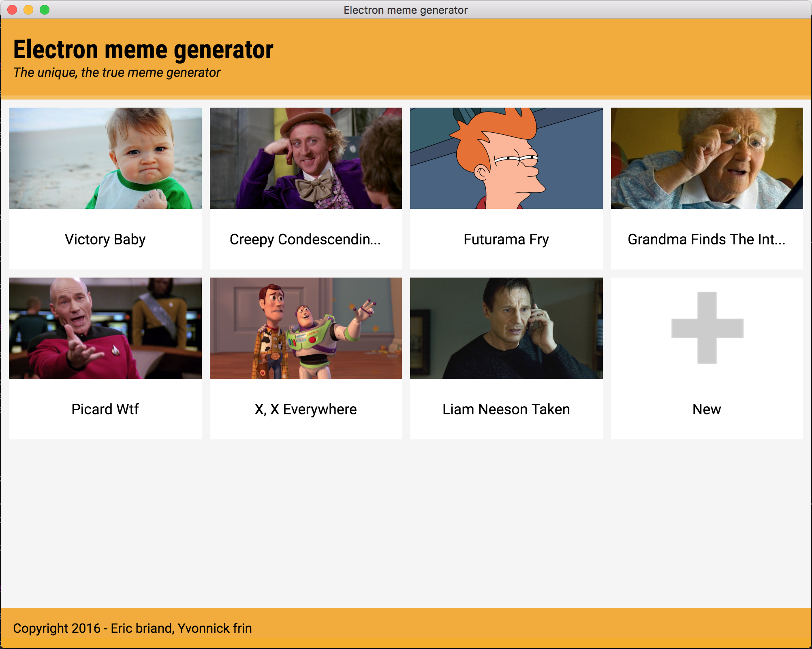
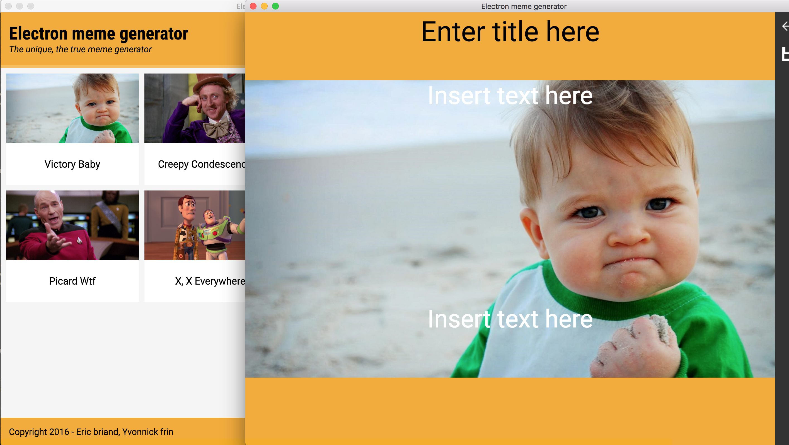
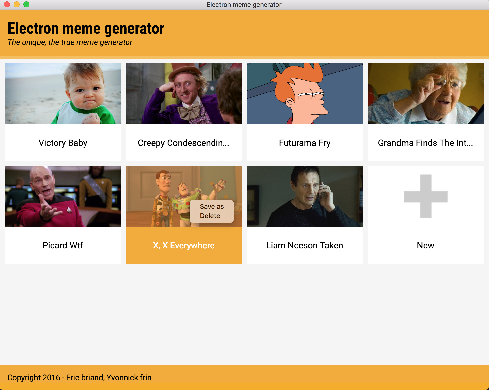
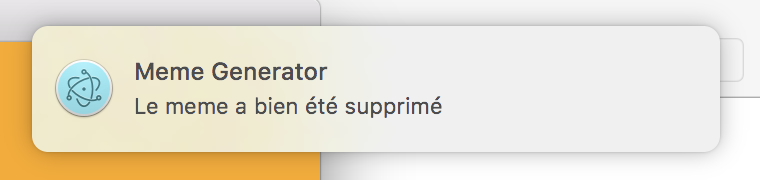

[](http://electron.atom.io/)

# Workshop Electron du Devfest Nantes 2016

Le but du workshop est de construire une application de génération de meme avec le framework Electron.

Le workshop sera cadencé par des présentations de nouveaux concepts à chaque étape.

Pour pouvoir continuer d'avancer même si une étape est problématique, nous vous fournissons les solutions de chacune des étapes.

## Description des répertoires :
```
solutions // solutions pour les différentes étapes
|-etape-01
|-etape-02
...
src
|-assets            CSS/images/js pour outillage
|-main-process      JS côté main-process
|-renderer-process  JS côté main-process
|-windows           HTML des différents windows
|-main.js         Point d'entrée de l'application
```

## Description des étapes

Afin de mettre en oeuvre les concepts d'electron vus dans le cours, nous vous proposons de développer une application de meme generator.

Nous partirons d'un squelette de projet electron simple, qui sera enrichie au fur et à mesure des étapes. Le résultat final sera une application desktop multi-fenêtré, avec des interactions et comportements d'une application desktop moderne.

Le squelette est composé de tous les fichiers de l'application. Vous n'aurez qu'à compléter ces fichiers.

### Etape 01 : Hello world!

Nous allons commencer par démarrer notre application electron en affichant une première page statique.

- Ouvrir le fichier `src/main.js`
- Importer les dépendances `app` et `BrowserWindow` depuis `electron`
- Sur l'événement `ready` de app, instancier une nouvelle `BrowserWindow`
- Charger le fichier `windows/hello.html` dans votre fenêtre nouvellement créée
- Démarrer votre application en executant `electron .`

Documentation nécessaire à l'étape :
- http://electron.atom.io/docs/api/app/
- http://electron.atom.io/docs/api/browser-window/

<details>
<summary>Solution</summary>
Dans le fichier `src/main.js`
```js
  const { app, BrowserWindow } = require('electron')
  const path = require('path')
```
```js
  mainWindow = new BrowserWindow()
  mainWindow.loadURL(path.join('file://', __dirname, 'windows/hello.html'))
```
</details>

Etat de l'application à la fin de l'étape

### Etape 02 : Customizer la fenêtre

Maintenant que notre application electron affiche une première fenêtre, nous vous proposons de changer l'affichage avec différentes options. Nous allons aussi exploiter la capacité de live-reloading du module `electron-connect`.

- Démarrer l'application en lançant `npm run dev`, l'application va démarrer en mode dev avec du live-reloading
- Changer la taille de la fenêtre dans le fichier `src/main.js`
- Enlever les bordures de la fenêtre
- Ouvrir par défaut les devTools via `mainWindow.webContents.openDevTools()`

Documentation nécessaire à l'étape :
- https://github.com/Quramy/electron-connect
- http://electron.atom.io/docs/api/browser-window/

<details>
<summary>Solution</summary>
Dans le fichier `src/main.js`
```js
  mainWindow = new BrowserWindow({ width: 1000, height: 800 })
  mainWindow.webContents.openDevTools()
```
</details>

Etat de l'application à la fin de l'étape

### Etape 03 : Affichage de la liste des memes

Nous allons maintenant afficher dans notre fenêtre la galerie de meme.

Dans le fichier `src/main.js`
- Changer le fichier HTML chargé dans la mainWindow par le fichier `windows/index.html`

Dans le fichier `src/windows/index.html`
- Require le fichier `src/renderer-process/grid.js` de manière relative à `index.html` dans la balise `<script>`

<details>
<summary>Solution</summary>
Dans le fichier `src/main.js`
```js
  mainWindow.loadURL(path.join('file://', __dirname, 'windows/index.html'))
```
Dans le fichier `src/windows/index.html`
```html
  <script type="text/javascript">
    require('../renderer-process/grid.js');
  </script>
```
</details>

Etat de l'application à la fin de l'étape

### Etape 04 : Inter Process Communication

Notre application maintenant affiche une liste statique d'images. La prochaine étape va consister à récupérer la liste des memes à afficher depuis un storage. Nous allons utiliser l'IPC (Inter Process Communication) pour échanger des informations entre le main-process et le renderer-process.

Dans le fichier `src/renderer-process/grid.js`
- Envoyer un message `get-memes` via le module `ipcRenderer`
- Déplacer le rendu de la galerie dans le callback appelé lors de la réception d'un message `meme-sended`
- Utiliser les images passées en paramètre de ce callback

Dans le fichier `src/main-process/grid.js`
- Mettre en place un handler pour le message `get-memes` avec le module `ipcMain`
- Dans le callback du handler, appeler la fonction `getMemes` qui prend un callback comme paramètre
- Dans le callback de `getMemes`, émettre en retour un message `meme-sended` avec la liste des images fourni en paramètre

Documentation nécessaire à l'étape :
- http://electron.atom.io/docs/api/ipc-renderer/#sending-messages
- http://electron.atom.io/docs/api/ipc-main/#listening-for-messages
- http://electron.atom.io/docs/api/ipc-main/#sending-messages

<details>
<summary>Solution</summary>
Dans le fichier `src/renderer-process/grid.js`
```js
const { ipcRenderer } = require('electron')
```
```js
ipcRenderer.on('memes-sended', (e, images) => {
  document.getElementById('content').innerHTML = images.reduce((prev, next, index) => {
    return `${prev}
    <div class="card meme" data-index="${index}">
    <div class="img" style="background-image:url('${next.path.split('\\').join('\\\\')}')"></div>
    <h3 title="${next.title}"><span>${next.title}</span></h3>
    </div>`
  }, '')
```
Dans le fichier `src/main-process/grid.js`
```js
const { ipcMain } = require('electron')
```
```js
ipcMain.on('get-memes', (e) => {
  getMemes(memes => {
    e.sender.send('memes-sended', memes)
  })
})
```
</details>

Etat de l'application à la fin de l'étape

### Etape 05 : File dialog

Maintenant que nous avons une liste prédéfinie, nous allons donner la possibilité à l'utilisateur de rajouter l'image de son choix via une file dialog.

Dans le fichier `src/renderer-process/grid.js`
- Ajouter un event listener `click` sur l'élément avec l'id `new-meme`
- Dans cet event listener, émettre un événement `open-file-dialog` avec l'IPC

Dans le fichier `src/main-process/grid.js`
- Dans celui-ci, importer le module `dialog` depuis `electron`
- Déclarer l'event handler `open-file-dialog`
- En réponse à cet event, afficher une `dialog` qui va lister seulement les fichiers images (extensions jpg, gif, png)
- Implémenter un callback qui va appeler la fonction `newEditWindow` avec le fichier choisi par l'utilisateur
- Gérer l'événement `closed` en renvoyant la liste à jour de meme

Documentation nécessaire à l'étape :
- http://electron.atom.io/docs/api/dialog/

<details>
<summary>Solution</summary>
Dans le fichier `src/renderer-process/grid.js`
```js
document.getElementById('new-meme').addEventListener('click', () => ipcRenderer.send('open-file-dialog'))
```
Dans le fichier `src/main-process/grid.js`
```js
const { ipcMain, dialog } = require('electron')
```
```js
ipcMain.on('open-file-dialog', (event) => {
  dialog.showOpenDialog({
    properties: ['openFile'],
    filters: [{ name: 'Images', extensions: ['jpg', 'png', 'gif'] }]
  }, (files) => {
    if (files) {
      const editWindow = newEditWindow(files[0])
      editWindow.on('closed', () => {
        getMemes(memes => {
          event.sender.send('memes-sended', memes)
        })
      })
    }
  })
})
```
</details>

Etat de l'application à la fin de l'étape

### Etape 06 : Menu contextuel

A cette étape, nous allons rajouter un menu contextuel pour effacer et sauvegarder chacune des images de la galerie de meme. Nous allons utiliser les classes de menu présentes dans electron.

- Ouvrir le fichier `src/renderer-process/grid.js`
- Importer le module `remote` depuis le module `electron` pour pouvoir accéder à l'API du main process
- Importer les classes `Menu` et `MenuItem` depuis `remote`
- Ajouter un event listener `contextmenu` sur chacun des élements de la galerie
- Créer un menu contextuel dans le callback de l'event listener avec comme items :
 - `Save as` qui enverra un message `save-from-grid` sur l'IPC
 - `Delete` qui enverra un message `deleted-selected-meme` sur l'IPC

Documentation nécessaire à l'étape :
- http://electron.atom.io/docs/api/menu/#render-process
- http://electron.atom.io/docs/api/menu-item/

<details>
<summary>Solution</summary>
Dans le fichier `src/renderer-process/grid.js`
```js
const { remote, ipcRenderer } = require('electron')
const { Menu, MenuItem } = remote
```
```js
element.addEventListener('contextmenu', e => {
  e.preventDefault()
  let menu = new Menu()
  menu.append(new MenuItem({label: 'Save as', click (item, browserWindow) { ipcRenderer.send('save-from-grid', images[parseInt(element.getAttribute('data-index'), 10)].path) }}))
  menu.append(new MenuItem({label: 'Delete', click (item, browserWindow) { ipcRenderer.send('delete-selected-meme', images[parseInt(element.getAttribute('data-index'), 10)]) }}))
  menu.popup(remote.getCurrentWindow())
})
```
</details>

Etat de l'application à la fin de l'étape

### Etape 07 : Notifications

Maintenant que nous avons la possibilité de rajouter et d'enlever des memes, nous allons émettre des notifications pour que l'utilisateur ait une confirmation de ses actions. Pour ce faire nous allons utiliser les notifications de l'API HTML5.

- Ouvrir le fichier `src/renderer-process/grid.js`
- Ajouter une notification en utilisant la classe `Notification` après l'effacement d'un meme
- Ajouter une notification après l'enregistrement d'un meme

Documentation nécessaire à l'étape :
- https://notifications.spec.whatwg.org/
- http://electron.atom.io/docs/tutorial/desktop-environment-integration/#notifications-windows-linux-macos

<details>
<summary>Solution</summary>
Dans le fichier `src/renderer-process/grid.js`
```js
new Notification('Meme Generator', { // eslint-disable-line no-new
  body: 'Le meme a bien été supprimé'
})
```
```js
new Notification('Meme Generator', { // eslint-disable-line no-new
  body: `Le meme a été sauvegardé à l'emplacement ${path}`
})
```
</details>

Etat de l'application à la fin de l'étape

### Etape 08 : Packaging

Nous allons terminer l'atelier en packageant notre application. Pour cela, nous allons utiliser electron-packager qui est maintenu par la communauté.

- Ouvrir le fichier `package.json`
- Ajouter un npm script `package` qui va appeler electron-packager
- Ajouter les options pour :
  - cibler votre plateforme et son architecture
  - ignorer les dépendances de développement
  - pouvoir repackager l'application même si le packaging a déjà été créé

Documentation nécessaire à l'étape :
- https://github.com/electron-userland/electron-packager
- https://github.com/electron-userland/electron-packager/blob/master/usage.txt

<details>
<summary>Solution</summary>
Dans le fichier `package.json`
```bash
electron-packager . --out=dist --app-version=$npm_package_version --platform=win32 --arch=x64 --prune --asar --overwrite --ignore \"node_modules/\\.bin\"
```
</details>

### Etape bonus : Testing

Pour ceux qui veulent aller plus loin, vous pouvez rajouter des tests.

- Ouvrir le fichier `src/tests/index.js`
- Rajouter les tests suivant :
  - l'application n'ouvre qu'une fenêtre au lancement
  - le titre de la fenêtre est bien `Electron meme generator`
  - la taille de la fenêtre est bien celle que vous avez précisé au lancement
  - l'application affiche au moins un meme (élément HTML de classe `meme`)

Documentation nécessaire à l'étape :
- https://github.com/electron/spectron#clientgetwindowcount
- https://github.com/electron/spectron#browserwindow
- https://github.com/electron/spectron#client

<details>
<summary>Solution</summary>
Dans le fichier `src/tests/index.js`
```js
it('opens only one window', function () {
  return app.client.getWindowCount().should.eventually.be.equal(1)
})

it('opens a window with "Electron meme generator" title', function () {
  return app.client.browserWindow.getTitle().should.eventually.equal('Electron meme generator')
})

it('opens a window with the right size', function () {
  return app.client.browserWindow.getBounds().should.eventually.have.property('width').and.be.equal(1000)
                   .browserWindow.getBounds().should.eventually.have.property('height').and.be.equal(800)
})

it('displays the list of memes', function () {
  return app.client.element('.meme').should.eventually.exist
})
```
</details>

Pour aller plus loin :
- Le site d'electron : http://electron.atom.io
- La liste awesome-electron qui regroupe plein de projets autour d'Electron : https://github.com/sindresorhus/awesome-electron
